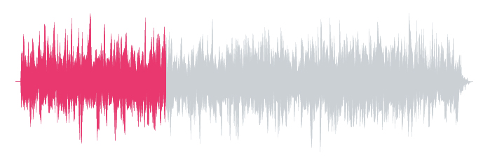

# ReactWaves

React component wrapper for [Wavesurfer.js](http://wavesurfer-js.org)

[](https://www.npmjs.com/package/@dschoon/react-waves) [](https://standardjs.com) [](https://circleci.com/gh/dschoon/react-waves)

#### Background

This component was originally based off of the work done in [react-wavesurfer](https://github.com/mspae/react-wavesurfer) by [@mspae](https://github.com/mspae) (and [others](<(https://github.com/mspae/react-wavesurfer/graphs/contributors)>)). After wavesurfer-js released version 2, and the react-wavesurfer projected became unmaintained, I decided that it was safer to start my own version that I had better control over.

#### Version 4.x

To align this component nicer with the base [wavesurfer.js](https://github.com/katspaugh/wavesurfer.js) project, I decided to skip version 2 and go straight to version 3. With wavesurfer now on version 4, we have made the necessary updates and are now also on v4.

#### Issues

Please report any [issues](https://github.com/dschoon/react-waves/issues) you encounter and I will try my best to get them fixed.

---

## Examples



Here's a basic demo and the example code include in this repo:

- **[Demo](https://dschoon.github.io/react-waves/)**
- **[Basic Example](https://github.com/dschoon/react-waves/blob/master/example/src/components/BasicExample.js)**
- **[Microphone Plugin Example](https://github.com/dschoon/react-waves/blob/master/example/src/components/MicrophoneExample.js)**
- **[Regions Plugin Example](https://github.com/dschoon/react-waves/blob/master/example/src/components/RegionsExample.js)**
- **[Timeline Example](https://github.com/dschoon/react-waves/blob/master/example/src/components/TimelineExample.js)**
- **[Large File Example](https://github.com/dschoon/react-waves/blob/master/example/src/components/LargeFilePeaksExample.js)**
- **[Generate PCM Data Example](https://github.com/dschoon/react-waves/blob/master/example/src/components/GetPeaksExample.js)**
- **[Spectrogram Example](https://github.com/dschoon/react-waves/blob/master/example/src/components/SpectrogramExample.js)**

Here's an example of the personal project where I'm using this code:

- **[Casts.co](https://pod.casts.co)** (formerly Clipps)
- **[Clipps Player (Demo)](https://dschoon.github.io/clipp-player)**

## Install

```bash
npm install @dschoon/react-waves
```

or

```bash
yarn add @dschoon/react-waves
```

## Basic Example

```jsx
import React from "react";
import ReactWaves from "@dschoon/react-waves";

import africa from "../audio/africa.mp3";

export default class BasicExample extends React.Component {
  state = {
    playing: false,
  };

  render() {
    return (
      <div className={"container example"}>
        <div
          className="play button"
          onClick={() => {
            this.setState({ playing: !this.state.playing });
          }}
        >
          {!this.state.playing ? "▶" : "■"}
        </div>
        <ReactWaves
          audioFile={africa}
          className={"react-waves"}
          options={{
            barHeight: 2,
            cursorWidth: 0,
            height: 200,
            hideScrollbar: true,
            progressColor: "#EC407A",
            responsive: true,
            waveColor: "#D1D6DA",
          }}
          volume={1}
          zoom={1}
          playing={this.state.playing}
        />
      </div>
    );
  }
}
```

## Available Props

```jsx
props = {
  playing: PropTypes.bool,
  pos: PropTypes.number,
  audioFile: (props, propName, componentName) => {
    const prop = props[propName];
    if (
      prop &&
      typeof prop !== "string" &&
      !(prop instanceof window.Blob) &&
      !(prop instanceof window.File)
    ) {
      return new Error(`Invalid ${propName} supplied to ${componentName}
        expected either string or file/blob`);
    }

    return null;
  },

  mediaElt: PropTypes.oneOfType([
    PropTypes.string,
    PropTypes.instanceOf(window.HTMLElement),
  ]),
  audioPeaks: PropTypes.array,
  volume: PropTypes.number,
  zoom: PropTypes.number,
  onPosChange: PropTypes.func,
  children: PropTypes.oneOfType([PropTypes.element, PropTypes.array]),
  options: PropTypes.shape({
    audioRate: PropTypes.number,
    audioContext: PropTypes.object,
    audioScriptProcessor: PropTypes.object,
    autoCenter: PropTypes.bool,
    backend: PropTypes.oneOf([
      "WebAudio",
      "MediaElement",
      "MediaElementWebAudio",
    ]),
    barGap: positiveIntegerProptype,
    barHeight: positiveIntegerProptype,
    barRadius: positiveIntegerProptype,
    barWidth: (props, propName, componentName) => {
      const prop = props[propName];
      if (prop !== undefined && typeof prop !== "number") {
        return new Error(`Invalid ${propName} supplied to ${componentName}
          expected either undefined or number`);
      }

      return null;
    },
    closeAudioContext: PropTypes.bool,
    cursorColor: PropTypes.string,
    cursorWidth: positiveIntegerProptype,
    fillParent: PropTypes.bool,
    forceDecode: PropTypes.bool,
    height: positiveIntegerProptype,
    hideScrollbar: PropTypes.bool,
    interact: PropTypes.bool,
    loopSelection: PropTypes.bool,
    maxCanvasWidth: positiveIntegerProptype,
    mediaControls: PropTypes.bool,
    mediaType: PropTypes.oneOf(["audio", "video"]),
    minPxPerSec: positiveIntegerProptype,
    normalize: PropTypes.bool,
    partialRender: PropTypes.bool,
    pixelRatio: PropTypes.number,
    progressColor: PropTypes.string,
    removeMediaElementOnDestroy: PropTypes.bool,
    renderer: PropTypes.object,
    responsive: PropTypes.bool,
    scrollParent: PropTypes.bool,
    skipLength: PropTypes.number,
    splitChannels: PropTypes.bool,
    waveColor: PropTypes.oneOfType([
      PropTypes.string,
      PropTypes.instanceOf(window.CanvasGradient),
    ]),
    xhr: PropTypes.object,
  }),
  spectrogramOptions: PropTypes.object,
  timelineOptions: PropTypes.object,
};
```

## License

MIT © [Dan Schoonmaker](https://schoon.me) [(github)](https://github.com/dschoon)

_Last Updated: November 11th, 2020_
